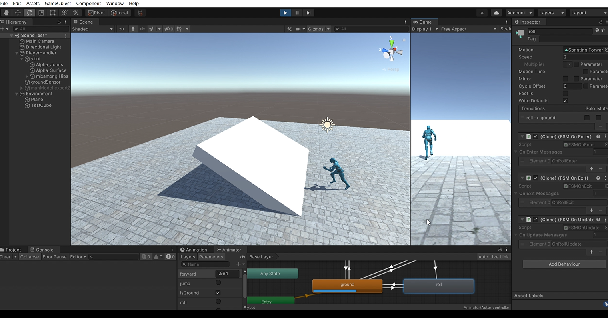
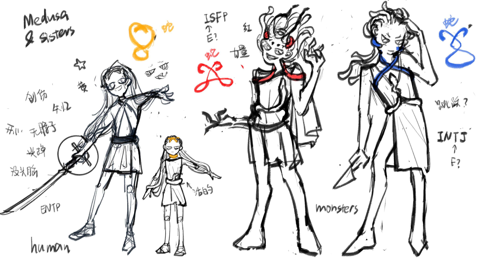
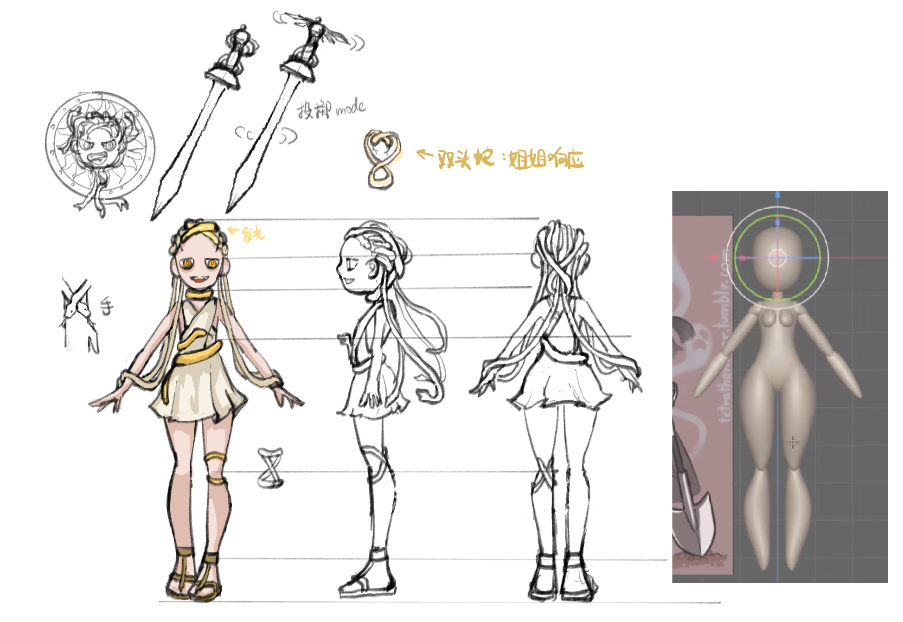
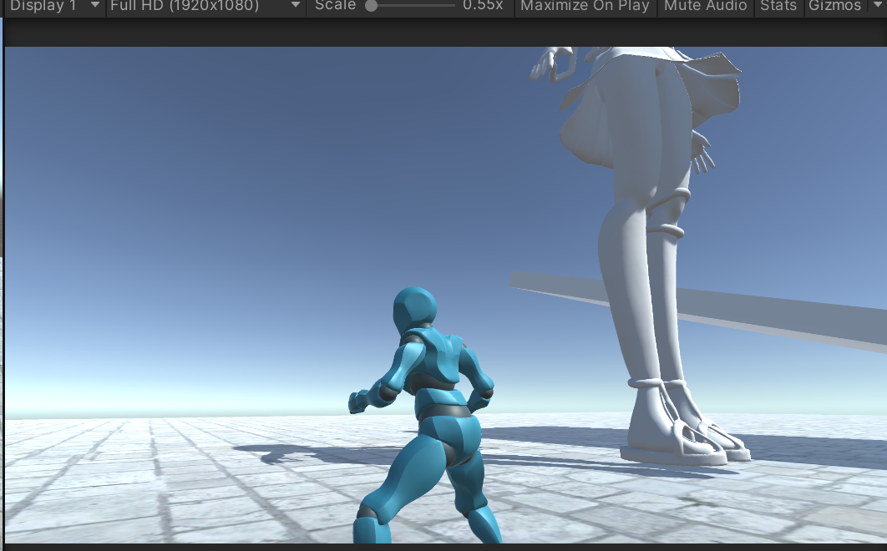
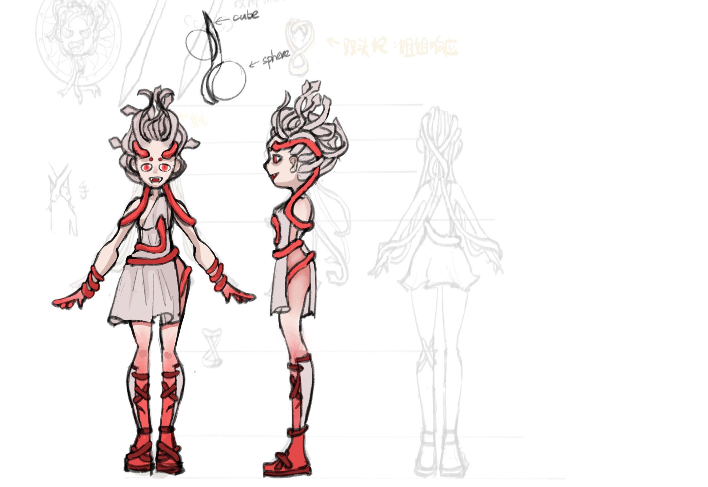

# Medusa and Sisters
reminder: the rotation of the plane should be bigger than 80 degree! //or the avatar will roll and fall!! （已修复，改变senser的offset高度就可以）

开发日志：
 
 11.17-11.20：git创建
 
 11.19：加入跳跃、奔跑、转弯平滑、地面检测、下落翻滚等基础移动
 
 wasd移动；j跳跃；k翻滚；left shift跑步

 11.20-11.22：主要人设以及美杜莎建模（未绑骨）blender和nomad

11.24: 原地跳跃闪避（后撤功能）；相机转动与移动、lerp平滑移动；丝西娜（红色姐姐）人设

