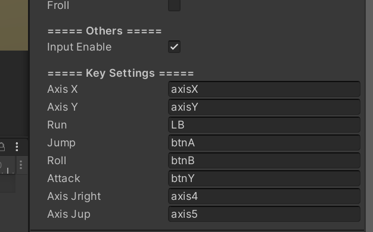
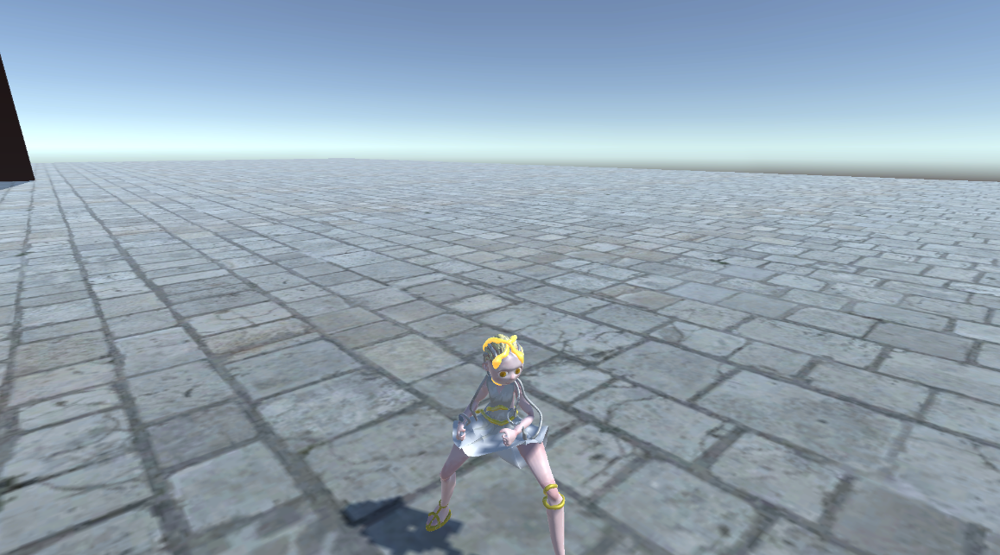

# Medusa and Sisters
reminder: the rotation of the plane should be bigger than 80 degree! //or the avatar will roll and fall!! 已修复，改变senser的offset高度就可以，去掉falling动画是代价:(

故事简介：三姐妹同心协力干掉魔王O(∩_∩)O

===== 操作按键 =====

手柄模式：左摇杆移动，左摇杆长按奔跑（需解锁）//右摇杆调整视野//A跳跃B翻滚Y攻击//原地跳跃闪避（需解锁）

纯键盘模式：WSAD移动，长按奔跑（需解锁）//↑↓←→调整视野//K跳跃L翻滚J攻击//原地跳跃闪避（需解锁）

键鼠模式：WSAD移动，长按奔跑（需解锁）//鼠标移动调整视野//F跳跃右键翻滚左键攻击//原地跳跃闪避（需解锁）

===== 攻击列表 =====

四连击：attack, attack, attack, ----attack

===== 能力解锁列表 =====

（能拆开卖就拆开）

最基础：能够攻击一下，走路，跳跃，jab（原地跳跃），移动视角

jab能够闪避 → canRun → （学会连招）canComboA1 → canComboA2 → （翻滚无敌）canRoll → （学会躲避）canRollDistance → （跳跃和翻滚中间可以加攻击）canFreeAttack

=============== 开发日志 ==================

 11.27：
 
 ===== 【MyBotton & MyTimer】 =====
 
 IsPressing：正在按下；
 
 OnPressed：刚开始按下；
 
 OnReleased：松手；
 
 IsExtending：记录松手后的1s，可用于double trigger
 
 IsDelaying：记录按键后的2s，可用于蓄力攻击
 
 放入了一个可以获得跑步能力的箱子，能够依次解锁cambo、翻滚、距离翻滚、自用攻击等不同的ability
  
  
 
 
 11.26: 
 加入四连技攻击，前三下节奏快，后一下节奏慢（动画event）；用GetLayerWeight等找当前动画状态，lerp攻击模式与移动模式切换；物理摩擦材质修bug；rigi与animation不同级的rootmotion处理；加上武器模型；手柄输入！abstract类控制面向对象；加个盾牌模型；传键盘/键盘+鼠标控制攻击和移动镜头；Botton的功能类别集成！
 
 
 
 11.25：
 更新URP，导入美杜莎人物模型、绘制texture、绑定骨骼、导入动画、复用animator controller、设置post processing

 
 11.24: 
 原地跳跃闪避（后撤功能）；相机转动与移动、lerp平滑移动；丝西娜（红色姐姐）人设

 11.20-11.22：
 主要人设以及美杜莎建模（未绑骨）blender和nomad

 
 11.19：
 加入跳跃、奔跑、转弯平滑、地面检测、下落翻滚等基础移动
 
 wasd移动；j跳跃；k翻滚；left shift跑步

 
 11.17-11.20：git创建
 

